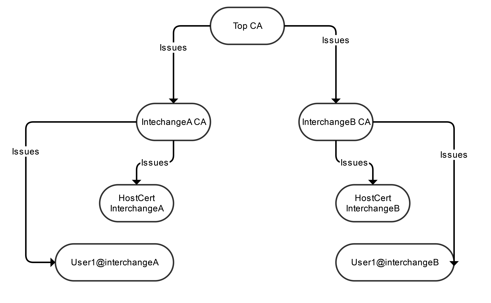
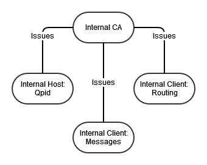

# Key structure in the Interchange network

The interchange network uses a custom Certificate Authority (CA), not the standard CA's 
that you typically use for web pages and in browsers. This is due to the use of mutual TLS [(mTLS)](https://en.wikipedia.org/wiki/Mutual_authentication#mTLS)
between interchanges, and between end-users and their interchange. 

All traffic, both internal and external, is encrypted, mostly using mTLS.

## Interchange CA

A root CA is maintained by the owners of the project, and issues a sub-CA for each of the interchanges
that is connected. The owner is typically the same as the owner of the DNS lookup entry.

Each interchange issues host certificate(s) for its node, and client certificates for the users 
(Service Providers). The Service Provider (SP) certificates are issued from the internal root CA, so that 
an SP can read and write messages to the local Interchange, and in the case of Redirect subscription,
can read from the Interchange that hosts the data stream.

## Internal CA

In addition, we have a separate, private CA for the internal services in the interchange. This is 
both for making sure that host names match with [SNI](https://en.wikipedia.org/wiki/Server_Name_Indication), and for security reasons.

