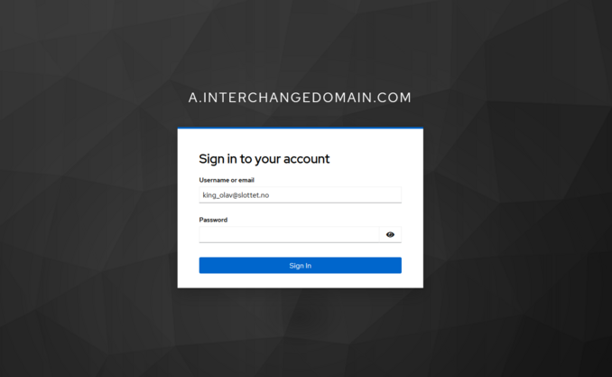
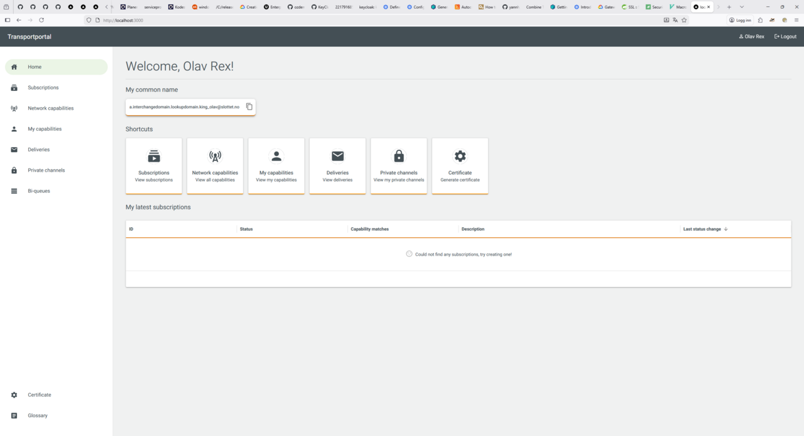
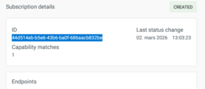

# Single node cluster

*Note that running the examples in this demo requires a bash-enabled terminal (Linux, Mac or WSL on Windows) and Docker/Docker compose installed.*

The `single-node.yml` file in this folder contains a Docker Compose dummy deployment of a single-node cluster.

## Run the cluster

In a terminal, go to the `demo/single-node` directory, and run `./single-node.sh`.
This will start the node, called `a.interchangedomain.com`.

There are two options to administer data on the node, either using the portal, or using the *service provider client*, which is a command-line client.
The portal is a self-service portal that can do *most* of the things that the service provider client can, and is sufficient in most cases.
The portal cannot, however, send and receive messages, like the service provider client can. For that reason, this guide will describe how to set up a 
message channel using the portal as well as the service provider client, but will only describe how to send and receive messages using the client.

## Using the portal

### Log in to the portal

In a browser, go to [the login page](https://localhost:3000/)

The username is `king_olav@slottet.no`, and the password is `password`
You should see the home page for the portal.

### Register a Capability

In order to be able to publish messages on the node, a [Capability](../../GLOSSARY.md#capability) and a [Delivery](../../GLOSSARY.md#delivery) has to be created.
We'll start by adding a Capability.

Click on `My capabilities`, `Add capability`

In the form, enter the data as shown (it's important that the data is entered as shown, or else the messages being sent in the later stages may not be routed correctly)

| Name                | Value         |
|---------------------|---------------|
| Publisher ID        | NO00000       |
| Publication ID      | NO00000:pub-1 |
| Protocol version    | DENM:1.2.2    |
| Originating country | NO            |
| Message type        | DENM          |
| Cause codes         | 5,6           |
| Quadtree            | 12003         |

Click the button `Create my capability`, and the capability should appear in the list of capabilities.

### Register a Delivery
In order to create a [Delivery](../../GLOSSARY.md#delivery), click on the three dots to the far right in the table. 

This shows the details of the newly created delivery.

and all the way at the bottom, you can potentially create a description of the the new Delivery, and click `Deliver`

Click `Deliveries` on the left-hand menu, and you should see a single row in the table. The status might be `REQUESTED` for a short time, while
the endpoint is being provisioned on the broker, but should end up in a `CREATED` state after a few seconds.

Click on the three dots on the fat right to see the details of the delivery including the [Endpoint](../../GLOSSARY.md#endpoint) to connect to
in order to send messages.

You have to use the service provider client to send messages, as described in [Publishing your first message](#publishing-your-first-message). But first, we need to 
register a subscription and listen to messages.

### Register a Subscription
In order to see messages flowing through the system, we can create a [Subscription](../../GLOSSARY.md#subscription) to the data stream, and listen to the associated queue.

In order to create a subscription, click on `Network capabilities` on the right-hand menu, and you should see your capability, as well as capabilities created by 
other users both on your instance, or any other interchanges in the cluster. In this demo, however, only your own capability will be listed.

Click on the three dots on the far right, and you should see the details of this capability. Enter a description for your new subscription on the bottom of the 
page, and click `Subscribe`

Click `Subscriptions` on the right-hand menu, and you should see the newly created subscription in the list. The status might be `REQUESTED` for a short time, while
the endpoint is being provisioned on the broker, but should end up in a `CREATED` state after a few seconds.

Click on the three dots on the fat right to see the details of the delivery including the [Endpoint](../../GLOSSARY.md#endpoint) to connect to
in order to receive messages.

You have to use the service provider client to receive messages, as described in [Listening to messages](#listening-to-messages). 

## Using the service provider client
The script `./a_service_provider_client.sh` runs the service provider client, a test client we provide for [Service Providers](../../GLOSSARY.md#service-provider)
Try running `./a_service_provider_client.sh --help` to see the different options. The client can also be used for sending and receiving messages. 

### Register a Capability

If you already registered a capability using the portal, you can skip this section.

In order to be able to publish messages on the node, a [Capability](../../GLOSSARY.md#capability) and a [Delivery](../../GLOSSARY.md#delivery) has to be created.
We'll start by adding a Capability.

The file `cap_king_olav_denm_no.json` contains the json structure for a request to create a Capability with the [publicationId](../../GLOSSARY.md#publicationid) `NO00000-pub-1` with the messageType DENM.

Run the command `./a_service_provider_client.sh capabilities add -f cap_king_olav_denm_no.json` to add the capability declared in the json file to the cluster.
The capability is now registered. Check using the command `./a_service_provider_client.sh capabilities list`. This lists your capabilities in the system.

### Register a Delivery

If you already registered a delivery using the portal, you can skip this section.

We have now declared what type of messages we want to publish, and now we have to create somewhere to actually do the publishing.
In order to do this, we need to create a [Delivery](../../GLOSSARY.md#delivery).

The file `del_king_olav_denm_no.json` declares a Delivery to the already registered Capability. 
Run the command `./a_service_provider_client.sh deliveries add -f del_king_olav_denm_no.json`, and make note of the id of the added delivery.
To get the actual endpoint to deliver messages on, run the command `./a_service_provider_client.sh deliveries get <id>` using the id from earlier.
You might have to do this a few times until the delivery has changed from status `REQUESTED` to status `CREATED`.
When the delivery has reached status `CREATED`, the delivery should have one item in the `endpoints` list, and the entry `target` specifies the name
of the actual [endpoint](../../GLOSSARY.md#endpoint) to publish messages on.

### Register a Subscription

If you already registered a subscription using the portal, you can skip this section.

In order to see messages flowing through the system, we can create a [Subscription](../../GLOSSARY.md#subscription) to the data stream, and listen to the associated queue.
The file `sub_king_olav_denm_no.json` declares a Subscription to listen for messages using the [publicationId](../../GLOSSARY.md#publicationid) of `NO00000-pub-1`
Run the command `./a_service_provider_client.sh subscriptions add -f sub_king_olav_denm_no.json`, and make note of the id of the added subscription.
To get the actual endpoint do receive messages on, run `./a_service_provider_client.sh subscriptions get <id>`, using the id from earlier.
You might have to do this a few times until the subscription has changed from status `REQUESTED` to status `CREATED`.
When the subscription has reached the status `CREATED`, the subscription should have one item in the `endpoints` list, and the entry `target` specifies the name
of the actual [endpoint](../../GLOSSARY.md#endpoint) to receive messages from.

## Listening to messages

To listen for messages, either copy the ID of the subscription from the portal

or use the `./a_service_provider_client.sh subscriptions list` to list out your subscriptions. Copy the id of the subscription, and use the command
`./a_service_provider_client.sh subscriptions listen -i <subscription id>` to start listening. The command will block, waiting for messages to arrive. 
Keep it running, and switch to a new console to publish messages.

## Publishing your first message

To send messages, either copy the ID of the delivery from the portal, or use the `./a_service_provider_client.sh deliveries list` command to list your 
deliveries. Copy the id of the delivery, and use the command 
Publishing messages is done using the command `./a_service_provider_client.sh messages send -f message_king_olav.json -i <delivery id>`. 
This will send a single message, defined in the json file used as an argument. 

You should now see a message logged on the console of the sink command. 
Congratulations! You have now registered a Capability with an associated Delivery, and a Subscription to receive the messages published.

This is all done on one interchange, and with a single user. Of course, this being a clustered system, it is fully possible to send data on one node, 
and receive data on another node.

