# User help

### How to register a Capability

You can create a new [Capability](../GLOSSARY.md#capability) by clicking on the `Add capability` button in the capability
tab. Click on `My capabilities`,
`Add capability`

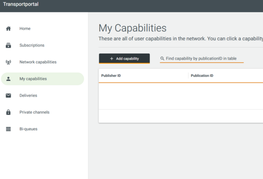

The following fields need to be filled out:

- `Publisher ID` A two-letter country code (e.g. NO or SE or DK) and a numerical identifier (value between 0 and 16383
  including leading zeroes) based on ISO 14816. If you do not have a ISO 14816 identifier you can contact your local
  interchange provider to get a temporary code to be used.
- `Publication ID` Alpha numeric (Allowed characters (no space): a-z A-Z 0-9 - _ ) identifier of the dataset chosen by
  you (the publisher of the dataset). Each dataset/publication identifier needs to be unique for the given publisher.
  PublicationId shall uniquely identify a single capability entry. E.g. npra_DENM_nor1
- `Protocol version` Represent the version of standard used to create the message. E.g. DENM:1.2.1 or DATEX2:3.1
- `Originating country` A two-letter country code (e.g. NO or SE or DK) representing the country where the data
  originates.
- `Message type` Type of message for the publication. E.g. DENM, DATEX2, IVIM
    - **Additional fields for DATEX2 publications**
        - `Publisher name` This is the identifier for the datex message distributer. Obtained from the
          nationalIdentifier section of the datex document.
        - `Publication type` Publication type (only one) E.g: SituationPublication or MeasuredDataPublication or
          VmsPublication
    - **Additional fields for DENM publications**
        - `Cause codes` select the cause codes this publication supports
- `Quadtree` Quadtree tiles representing the coverage area of the publication, comma sparated without spaces with a
  leading and trailing comma. E.g. ,01223,102332,012322, If you click on the "Show map" button it will open a tool to
  help you create the tiles. Zoom in and click on the tiles to add them to the list. click on the tile again to remove
  it. Click save to return to the "Add capability" screen.

Following is an example of how the fields can be filled out.

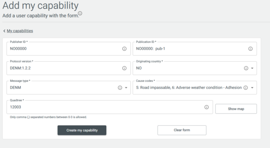

| Name                | Value         |
|---------------------|---------------|
| Publisher ID        | NO00000       |
| Publication ID      | NO00000:pub-1 |
| Protocol version    | DENM:1.2.2    |
| Originating country | NO            |
| Message type        | DENM          |
| Cause codes         | 5,6           |
| Quadtree            | 12003         |

Once a capability has been created by clicking the `Create my capability` button you should see it in the list of
capabilities, either in `My capabilities` or ` Network capabilities` tab. By clicking on a capability row, you can view its details in the side window.

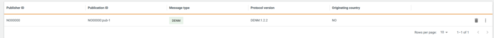

### How to register a Delivery

In order to create a [Delivery](../GLOSSARY.md#delivery), you can click on `Create delivery` from `Deliveries` tab and create a
delivery by clicking on the listed capabilities. You can also click on advanced mode and write your own selector by
using a
provided cheat sheet. 

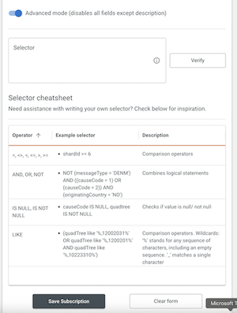

While creating a delivery you have the option to enable the dead letter
queue (dlq) for the delivery you are creating. Messages that cannot be delivered are moved to dlq. After you click on `Save delivery`, 
you should see the created delivery in the table. The status might be `REQUESTED`for a short time, while
the endpoint is being provisioned on the broker, but should end up in a `CREATED` state after a few seconds.

Click on the three dots on the far right to see the details of the delivery including the endpoint to connect to in order to send messages.

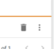

There is also another way of creating a delivery. In `My capabilities` tab click on the three dots of a `Create delivery`
capability to the far right in the table and all the way at the bottom, you can potentially create a description of the new Delivery (description is optional),
and click `Deliver`

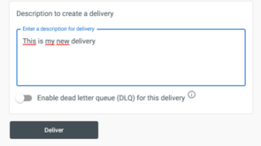

This shows the details of the newly created delivery. While creating a delivery you have the option to
enable the dead letter queue (dlq) for the delivery you are creating. Messages that cannot be delivered are moved to dlq. You can also remove
the capability that you have just created from the capability details side window.

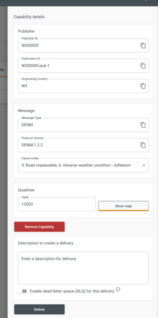

## Subscription

Subscriptions are what a client uses to obtain a stream or several streams of data. Subscriptions are matched against
Capabilities in the cluster, and creates endpoints for the client to fetch messages from. The Capabilities subscribed
to can belong to the Service Provider, other Service Providers on the interchange, or to other interchanges, replicated
over the Improved Interface described in the [specification](https://www.c-roads.eu/).
Service providers are the users of the system, be it a person or an integrated system. Service Providers use the
Onboard API to communicate with the interchange in order to create Subscriptions, Capabilities or Deliveries.

### How to register a Subscription

In order to see messages flowing through the system, we can create a subscription to
the data stream, and listen to the associated queue.

In order to create a subscription, click on `Network capabilities` on the right-hand menu, and you should see your
capability, as well as capabilities created by
other users both on your instance, or any other interchanges in the cluster. In this demo, however, only your own
capability will be listed.

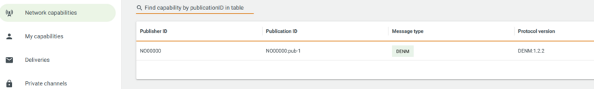

Click on the three dots on the far right, and you should see the details of this capability. Enter a description for
your new subscription on the bottom of the
page (description is optional), and click `Subscribe`

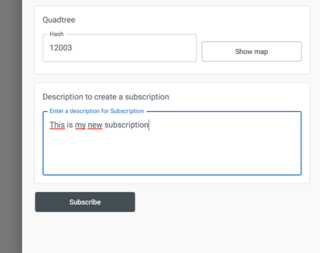

Click `Subscriptions` on the right-hand menu, and you should see the newly created subscription in the list. The status
might be `REQUESTED` for a short time, while
the endpoint is being provisioned on the broker, but should end up in a `CREATED` state after a few seconds.

Click on the subscription or the three dots on the far right side to see the details of the subscription including
the endpoint to connect to in order to receive messages.

There is also another way of creating a subscription. You can click on `Add subscriotion` from `Subscriptions` tab and
create a
subscription by clicking on the listed capabilities. You can also click on advanced mode and write your own selector by
using a
provided cheat sheet.

## Private channels

In [private channels](../GLOSSARY.md#private-channels) tab you can display, create and delete peers from private channels they own 
or remove them from other private channels that are subscribed to them.

### How to register a Private channel

A private channel can be added by clicking on the `Create private channel` button where you can add a peer name and
description.
Name of the private channels' peer is optional but description is mandatory. After a private channel is shown up in the
list you can click on the three dots on the far right side to see
the private channel details. The status might be `REQUESTED` for a short time but should end up in a `CREATED` state
after a few seconds.
You can also add or remove peers or even remove the private channel from the side window.
The endpoint for the private channel consists of the hostname, port and the private channels' queue name.

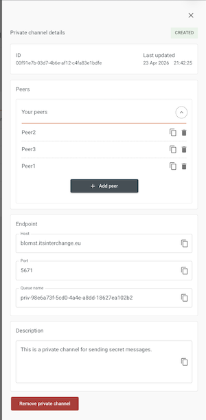

If another service provider has created a private channel subscribed to yours, it will appear in the
`My private channel subscriptions`
list. 

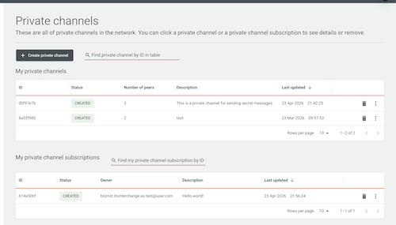

You can use the `common name` of the other service provider as the peer name while creating a private channel.
`Common name` can be copied from `My common name` section in `Home` tab.

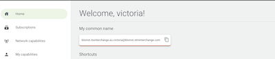

## Bi-queues

In [Bi-queues](../GLOSSARY.md#bi-queues) tab you can see the list of bi-queues per [message type](../GLOSSARY.md#messagetype-).
You can also add or remove access to the bi-consumer's group.

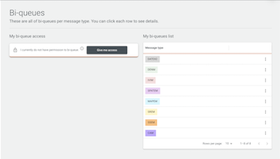

By clicking on each bi-queue from the list you can see the bi-queue endpoint details. 

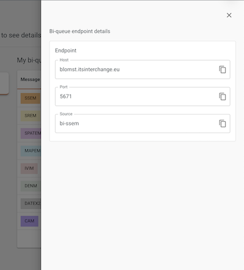

## Certificate

You can generate the key and certificate in the portal in order to generate the key and trust stores for using the
Interchange.

### How to create a Certificate

Enter the country code and the organisation name, and click `Generate certificate` and download the private key, chain
certificate and root certificate. 

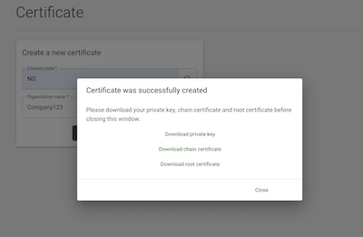

